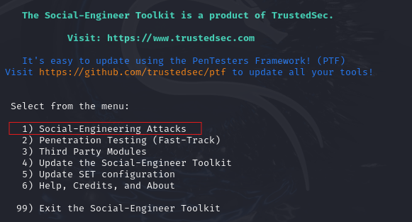
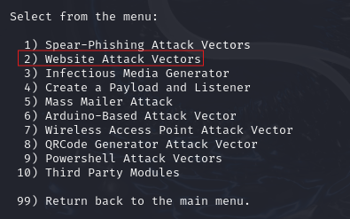
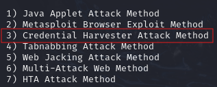
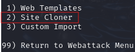
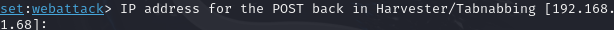
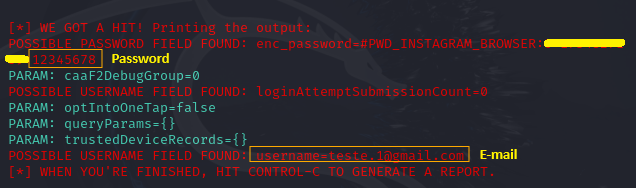

## **SOCIAL ENGINEER - PHISHING USING SETOOLKIT**

Hello there! This is my project to teach you how to create a phishing attack using the SEToolkit tool.

You will need it:

- Linux

 Let's configure the phishing...

Your first step is to open the shell and active the user root.

Start the setoolkit.

The next step, choose the following options:

Social-Engineering Attacks.

Web Site Attack Vectors.

Credential Harvester Attack Method.

Site Cloner.

Insert a site domain or click Enter to get the IP address of the machine.

Copy and paste the website that you want to clone.

Enter the address you choose in the browser to access the clone. Clone site will be this one.

The data that is entered will appear in the script in red.

